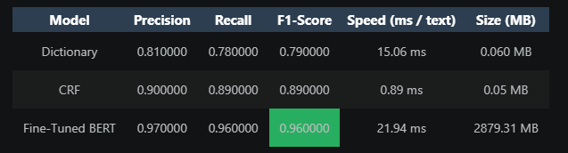

# 🏔️ Mountain Name Recognition

A lightweight NLP project for detecting mountain names in English text using multiple NER strategies: dictionary matching, CRF, and fine-tuned BERT.

---

# Project Overview

This repository compares multiple approaches for mountain-name recognition in text and evaluates their trade-offs.

Current implementation includes:

- Dictionary-based NER
- CRF-based NER
- BERT fine-tuning with Hugging Face Transformers
- Dataset generation and preprocessing
- Model comparison pipeline

---

# Project Structure

```text
task 1/
├── README.md
├── config.yaml
├── main.py
├── image.png
├── data/
│   ├── raw/
│   ├── processed/
│   └── final/
│       ├── train.json
│       ├── validation.json
│       └── test.json
├── models/
│   └── crf/
├── notebooks/
│   ├── demo.ipynb
│   └── presentation.ipynb
├── scripts/
│   ├── compare_models.py
│   ├── create_dataset.py
│   ├── run_full_pipeline.py
│   ├── scrape_mountains.py
│   ├── train_bert.py
│   └── train_crf.py
├── src/
│   ├── deep_learning/
│   ├── evaluation/
│   ├── generation/
│   ├── llm/
│   ├── models/
│   ├── preprocessing/
│   ├── scraper/
│   ├── training/
│   └── utils/
├── .gitignore
└── _legacy_/
```

---

# Installation

From the repository root:

```bash
cd "task 1"
pip install -r requirements.txt
```

If the dependency file is missing, install the core packages manually:

```bash
pip install numpy pandas scikit-learn torch transformers datasets python-dotenv
```

---

# Configuration

The main project configuration is stored in:

```text
config.yaml
```

This file defines dataset paths, model parameters, and training settings.

---

# Usage

## 1) Scrape mountain names

```bash
python scripts/scrape_mountains.py
```

## 2) Build the dataset

```bash
python scripts/create_dataset.py
```

## 3) Train CRF baseline

```bash
python scripts/train_crf.py
```

## 4) Train BERT model

```bash
python scripts/train_bert.py --epochs 3 --batch-size 8
```

## 5) Run the full pipeline

```bash
python scripts/run_full_pipeline.py
```

## 6) Compare model outputs

```bash
python scripts/compare_models.py
```

---

# Dataset

The project uses JSON annotation files under:

```text
data/final/
```

Typical data format:

```json
{
  "tokens": ["Mount", "Everest", "is", "high"],
  "labels": ["B-MOUNTAIN", "I-MOUNTAIN", "O", "O"]
}
```

---

# Notes

- This README reflects the actual script names present in the repository.
- Some older legacy code remains under `_legacy_` and is not part of the active pipeline.
- For reproducibility, random seeds are set centrally in the utility module.

---

# Model Summary

## Dictionary NER

- Rule-based
- Very fast
- limited generalization

## CRF

- Sequence model
- lightweight and interpretable
- requires feature engineering

## BERT

- strongest performance in practice
- needs more compute and tuning
- works well on unseen mountain names

---

# Evaluation

The project supports evaluation using Precision, Recall, and F1-score.

Suggested comparison:


---

# Pipeline

```text
             Wikidata
                 │
                 ▼
        Mountain Scraper
                 │
                 ▼
        Dataset Builder
                 │
                 ▼
     Train / Validation Data
          │            │
          │            │
     Dictionary      CRF
          │            │
          └──────┐     │
                 ▼     ▼
             BERT Fine-Tuning
                    │
                    ▼
               Predictions
                    │
                    ▼
              Local LLM Judge
```

---

# Technologies

* Python 3.11
* Hugging Face Transformers
* PyTorch
* datasets
* scikit-learn
* sklearn-crfsuite
* pandas
* requests
* PyYAML
* Jupyter Notebook

---

# Future Improvements

* Multi-language support
* Additional geographical entities
* Larger training dataset
* ONNX model export
* Model quantization
* Hyperparameter optimization
* Automatic benchmark generation

---
